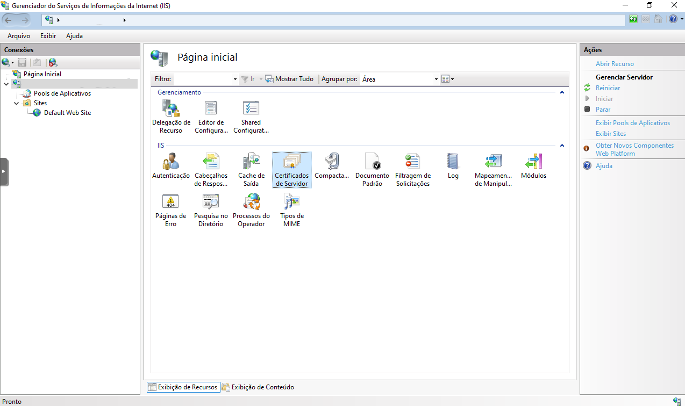

# English
## Configure a TLS certificate
Ref: [FactoryTalk View Site Edition Installation Guide (rockwellautomation.com)](https://literature.rockwellautomation.com/idc/groups/literature/documents/in/viewse-in003_-en-e.pdf).
> This document was made for easy access, consult the reference document above before applying it.

If you have enabled HTTPS during the installation, configure a Transport Layer Security (TLS) certificate on the HMI server, FactoryTalk View Studio, and FactoryTalk ViewPoint SE server computers. Certificates from your organization's internal Certificate Authority (CA) and a commercial CA are supported. If you want to use a commercial certificate, you need to obtain it by sending a request to a CA. Once you have a certificate, install it on all HMI server and FactoryTalk View Studio computers. The steps may vary on different operating systems.
### Create a local certificate (for testing only)
Ref: [Create a self-signed public certificate to authenticate your application | Microsoft Learn](https://learn.microsoft.com/en-us/azure/active-directory/develop/howto-create-self-signed-certificate)
#### Option 1: Create .cer certificate
```powershell
$certname = "certificateName" ## Replace {certificateName}
$cert = New-SelfSignedCertificate -Subject "CN=$certname" -CertStoreLocation "Cert:\CurrentUser\My" -KeyExportPolicy Exportable -KeySpec Signature -KeyLength 2048 -KeyAlgorithm RSA -HashAlgorithm SHA256
Export-Certificate -Cert $cert -FilePath "C:\TempCerts\$certname.cer"
```
#### Option 2: Create .pfx certificate
```powershell
$certname = "certificateName" ## Replace {certificateName}
$mypwd = ConvertTo-SecureString -String "myPassword" -Force -AsPlainText  ## Replace {myPassword}
$cert = New-SelfSignedCertificate -Subject "CN=$certname" -CertStoreLocation "Cert:\CurrentUser\My" -KeyExportPolicy Exportable -KeySpec Signature -KeyLength 2048 -KeyAlgorithm RSA -HashAlgorithm SHA256
Export-PfxCertificate -Cert $cert -FilePath "C:\TempCerts\$certname.pfx" -Password $mypwd   ## Specify your preferred location
```
### To install a TLS certificate: 
1. On the HMI server, FactoryTalk View Studio, and FactoryTalk ViewPoint SE server computers, open Internet Information Services (IIS) Manager. 
>	Tip: The Setup wizard detects and installs IIS automatically if IIS is not available on the computer. 
2. Under IIS, double-click Server Certificates. 
3. In the Actions pane: 
	- If you have a PFX file containing the certificate (public keys) and the corresponding private keys, click Import. 
	- If you have a file received from a CA containing the CA's response (a CER file, for example), click Complete Certificate Request. 
4. Add the certificate. 
	- If you selected Import: 
		1. In the Import Certificate dialog box, click the browse button.
		2. Navigate to the PFX file, and then click Open. 
		3. Enter the password. 
		4. Click OK. 
	- If you selected Complete Certificate Request: 
		1. On the Specify Certificate Authority Response page, click the browse button. 
		2. Navigate to certificate file, and then click Open. 
		3. Enter a name for the certificate in the Friendly name box. 
		4. Click OK. 
After installing the certificate, make sure the TLS certificate is selected for the HTTPS site binding. 
### To select a TLS certificate for the HTTPS site binding: 
1. On the HMI server and FactoryTalk View Studio computers, in the Connections pane of Internet Information Services (IIS) Manager, go to the server and site that the certificate binds to. 
2. In the Actions pane, click Bindings. 
3. In the Site Bindings dialog box, select the HTTPS site binding, and then click Edit. 
4. From the SSL certificate list, select the desired certificate. 
5. Click OK

# Português (Brasil)
## Configurar certificados TLS
Ref: [FactoryTalk View Site Edition Installation Guide (rockwellautomation.com)](https://literature.rockwellautomation.com/idc/groups/literature/documents/in/viewse-in003_-en-e.pdf).
> Este documento foi feito para facilidade de acesso, consulte o ducumento de referência acima antes de aplicá-lo.

Se foi habilitado HTTPS durante a intalação, configure o certificado TLS no servidor de HMI, FactoryTalk View Studio, e servidores do FactoryTalk ViewPoint SE. São suportados certificados de autoridades de certificação comerciais e certificados de autoridades de certificações internos de sua própria organização. Se optar por utilizar certificados comerciais, você deve obte-los enviando requisições à autoridade de certificação. Os passos podem variar de acordo com o sistema operacional.

### Criar certificados locais (utilize apenas para testes)
Ref: [Criar um certificado público autoassinado para autenticar seu aplicativo | Microsoft Learn](https://learn.microsoft.com/pt-br/entra/identity-platform/howto-create-self-signed-certificate?source=docs)
#### Opção 1: Criar certificado .cer
```powershell
$certname = "certificateName" ## Replace {certificateName}
$cert = New-SelfSignedCertificate -Subject "CN=$certname" -CertStoreLocation "Cert:\CurrentUser\My" -KeyExportPolicy Exportable -KeySpec Signature -KeyLength 2048 -KeyAlgorithm RSA -HashAlgorithm SHA256
Export-Certificate -Cert $cert -FilePath "C:\TempCerts\$certname.cer"
```
#### Opção 2: Criar certificado .pfx
```powershell
$certname = "certificateName" ## Replace {certificateName}
$mypwd = ConvertTo-SecureString -String "myPassword" -Force -AsPlainText  ## Replace {myPassword}
$cert = New-SelfSignedCertificate -Subject "CN=$certname" -CertStoreLocation "Cert:\CurrentUser\My" -KeyExportPolicy Exportable -KeySpec Signature -KeyLength 2048 -KeyAlgorithm RSA -HashAlgorithm SHA256
Export-PfxCertificate -Cert $cert -FilePath "C:\TempCerts\$certname.pfx" -Password $mypwd   ## Specify your preferred location
```
### Instalar certificado TLS: 
1. No servidor HMI, FactoryTalk View Studio, e servidor FactoryTalk ViewPoint SE, abra o Gerenciador do Serviços de Informações de Internet (IIS). 
>	Dica: O instalador detecta e instala o IIS automaticamente caso não esteja disponível no computador. 
2. No gerenciador do IIS, abra "Certificados do Servidor", localizado no nível hierarquico do seu servidor. 

3. No painel de Ações, localizado no lado direito do gerenciador: 
	- Se você tem um arquivo .pfx contendo o certificado (chave publica) e a chave privada correspondente, clique em Importar. 
	- Se você tem um arquivo .cer recebido de uma autoridade de certificação, clique em Concluir Solicitação de Certificado. 
4. Adicione o certificado. 
	- Se você selecionou Importar: 
		1. Na janela aberta, selecione o arquivo de certificado .pfx.
		2. Digite a senha criada com o certificado no campo apropriado. 
		3. Clique em OK. 
	- Se você selecionou Concluir Solicitação de Certificado: 
		1. Na janela aberta, selecione o arquivo de certificado .cer. 
		2. Dê um nome ao certificado. 
		3. Clique em OK. 
Após concluir a instalação do certificado, vincule o certificado como HTTPS do site RSViewSE. 
### Selecione o certificado TLS para vincular ao HTTPS do site: 
1. No servidor HMI e computadores com FactoryTalk View Studio instalado, no painel Conexões do gerenciador IIS, selecione o servidor e site onde deseja vincular o certificado. 
2. No painel Ações, clique em Associações. 
3. Na caixa de diálogo aberta, selecione a conexão HTTPS do site, então clique em Editar. 
4. Selecione o certificado SSL desejado. 
5. Clique em OK